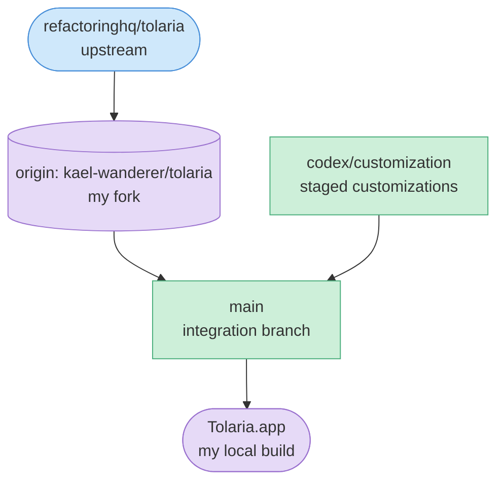

# Tolaria (Kael's fork) — customized

**Status:** live  ·  **Owner:** Kael (cong.bui)  ·  **Upstream:** https://github.com/refactoringhq/tolaria

This is my personal fork of [Tolaria](https://github.com/refactoringhq/tolaria), a Tauri 2 + React markdown vault app. I track the author's upstream and add a single, **local-only appearance customization layer** (extra color themes, editor fonts, and per-region font sizes) plus a few **local-build fixes** (disabled auto-updater, unsigned local builds). My changes are isolated under `src/customization/` so I can pull upstream updates and re-apply my work with minimal conflicts.

This wiki documents **the fork itself** — what I changed, why, and how I keep it in sync — not upstream Tolaria's features. For the base app, read the author's docs (see [reference/](reference/README.md)).

## At a glance
- **What it is:** a fork of Tolaria with a local Customization settings section (themes, fonts, font sizes) and local-build tweaks
- **Branch model:** `main` (my integration branch, tracks `upstream/main`) + `codex/customization` (where customization commits are staged)
- **How I stay current:** `git fetch upstream` → rebase/merge `main` onto `upstream/main` → re-apply customizations → verify → push to `origin/main`
- **Forked at:** `b84d6579` (2026-05-30)
- **Customizations live in:** `src/customization/` + small integration points (Settings panel, theme hook, updater, Vite config)

## Hero diagram

## Read next
- [Why I forked it](01-origin.md)
- [Timeline & sync log](02-timeline.md)
- [Architecture & branch model](03-architecture.md)
- [Customization inventory (design)](design/customizations.md)
- [How to sync with upstream (reference)](reference/how-to-sync.md)
- [Fork lessons & gotchas](lessons.md)
