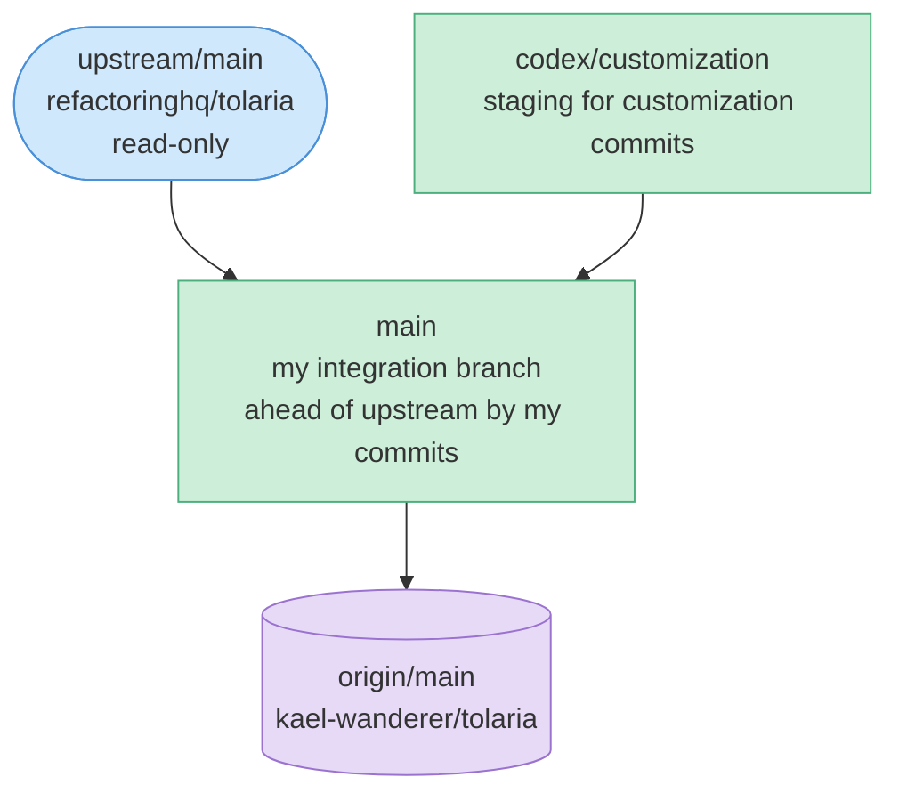
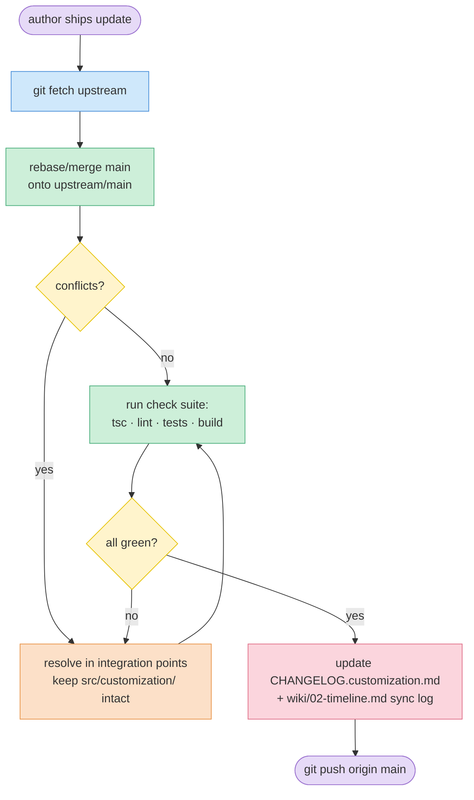

# Architecture & branch model

This page describes how the **fork** is structured — not how Tolaria itself works. For the base app architecture, read upstream's `docs/ARCHITECTURE.md` (linked from [reference/](reference/README.md)).

## Branch model

Three references matter:

| Ref | Role | Reality today |
|-----|------|---------------|
| `upstream/main` | Read-only mirror of the author's repo. I never commit here; I only `fetch`. | At `b84d6579` |
| `main` | **My integration + working branch.** Tracks `upstream/main`, carries my customizations on top, and is what I build/run/push. AGENTS.md rule: push directly to `main`. | Ahead of `upstream/main` by 2 commits (`3643850c`, `9fd796df`) |
| `codex/customization` | Staging branch where customization commits are authored before landing on `main`. | Parked at the fork point `b84d6579` (no commits beyond upstream right now) |

> **Why both `main` and `codex/customization`?** `codex/customization` keeps a clean record of "just my changes" so I can cherry-pick / re-apply them onto a freshly-pulled `main`. In day-to-day use the customizations live on `main` (that is the branch I build and push). When upstream moves, I re-apply my thin layer on top of the new upstream base — see the sync flow below.

## What I touch (and what I deliberately don't)

My change surface is intentionally small and **additive-first**. New files never conflict; edited upstream files are the only conflict risk.

**New files I own (low/no conflict risk):**
- `src/customization/` — the whole feature: `customAppearance.ts`, `useCustomAppearance.ts`, `CustomizationSettingsSection.tsx`, plus tests
- `CHANGELOG.customization.md`, `docs/CUSTOMIZATION.md`

**Upstream files I edit (the conflict-prone integration points):**
- `src/components/SettingsPanel.tsx`, `SettingsBodyNav.tsx`, `settingsSectionIds.ts` — register the Customization section
- `src/hooks/useTheme.ts` — merge my theme variables
- `src/hooks/useAppPreferences.ts`, `src/hooks/useMenuEvents.ts` — wire preferences
- `src/App.css`, `src/components/Editor.css`, `EditorTheme.css` — consume my CSS variables
- `src-tauri/src/app_updater.rs`, `src-tauri/tauri.conf.json` — disable updater / unsigned local builds
- `vite.config.ts` — raise chunk-size warning limit
- `src/lib/locales/*.json` — new UI strings (en.json is source; others are translated)

Full file-by-file table with conflict risk: [design/customizations.md](design/customizations.md).

## Upstream sync flow

The exact commands are in [reference/how-to-sync.md](reference/how-to-sync.md); the diagram-only version lives in [diagrams/sync-flow.md](diagrams/sync-flow.md).

## Why this survives upstream merges

Because the feature is isolated under `src/customization/` and everything else is a **few-line touch** at well-defined integration points, an upstream bump only conflicts where upstream itself edits those same lines (most likely `SettingsPanel.tsx`, `useTheme.ts`, locale files, or `tauri.conf.json`). The customization logic itself is never the thing in conflict. See [lessons.md](lessons.md) for the spots that actually bite.
