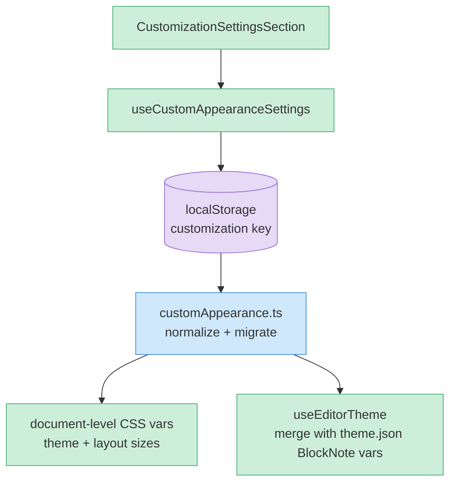

# Deep dive: appearance customization layer

The one non-trivial change in this fork (commit `3643850c`). This summarizes the design; the canonical implementation reference is `docs/CUSTOMIZATION.md` at the repo root.

## Scope & guarantee

Customization is **installation-local**. It is stored in Tauri/browser `localStorage` via `src/customization/customAppearance.ts` and **never** writes to vault markdown, Type documents, app settings JSON, or any remote. This is the property that keeps the fork safe: my appearance preferences can't leak into vault content or get pushed.

It is exposed as a dedicated **Customization** Settings section, kept separate from upstream's Light/Dark/System appearance mode so the two don't fight.

## Controls

| Control | Options | Notes |
|---------|---------|-------|
| **Theme** | Default, Everforest Dark, Catppuccin Mocha, Nord, Tokyo Night, Dracula, Gruvbox Dark, Custom | Custom = a known alias string (`Tokyo Night`) **or** a small JSON object with `background`, `surface`, `text`, `accent`, `border` |
| **Editor font** | Default, Inter, Georgia, Merriweather, JetBrains Mono, SF Mono, Menlo, Iosevka Nerd Font Mono, Custom | Custom = CSS font-family string or a plain installed family name (auto-quoted, `sans-serif` fallback) |
| **Sidebar font size** | 12–30 presets + custom number | Left nav, filters, folders, types, saved views |
| **Note list font size** | 12–30 presets + custom number | Middle note list |
| **Editor font size** | 12–30 presets + custom number | Note body, inline code, tables, derived heading sizes |

## Runtime design

`customAppearance.ts` owns: the storage key + change event, normalization/migration of stored values, theme preset variable maps, custom theme alias + JSON parsing, editor CSS variable export, and document-level theme/layout variable application.

Sidebar and note-list sizes apply through document-level CSS variables (`--custom-sidebar-font-size`, `--custom-note-list-font-size`), consumed by `.app__sidebar` and `.app__note-list` in `App.css`. Editor font/size flow into `useEditorTheme`, merged with the existing `theme.json`-derived BlockNote variables.

## Migration / compatibility

The original single `fontSize` field is treated as a **legacy editor font size**: on load it migrates into `editorFontSize`, so older local customization stays visible after the split into Sidebar / Note list / Editor sizes.

## Why it survives upstream merges

The logic is isolated under `src/customization/`. An upstream update should usually merge by keeping (a) the Settings section registration and (b) the small theme/layout integration points, then resolving any conflicts **inside** the customization module rather than across the codebase. See [../03-architecture.md](../03-architecture.md) and [../lessons.md](../lessons.md).

## Known follow-ups

- `pnpm l10n:translate` needs `LARA_ACCESS_KEY_ID` / `LARA_ACCESS_KEY_SECRET`; non-English customization labels currently fall back to English.
- Custom theme is intentionally minimal — aliases + simple JSON colors, **not** full VS Code theme import.
- No macOS font auto-discovery — custom font expects a typed installed family name.
