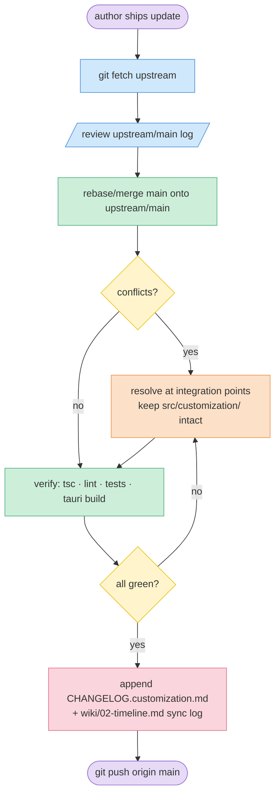

# Diagram: upstream sync flow

Visual-only. Steps in [reference/how-to-sync.md](../reference/how-to-sync.md).

Legend: **lookup** = fetch upstream · **action** = re-apply customizations / verify · **guard** = decision · **reject** = conflict path · **audit** = log write · **session** = confirm/publish.

> Hero PNG: export an Excalidraw version to `png/sync-flow.png` if a polished image is needed for a presentation. The Mermaid above stays the source of truth.
